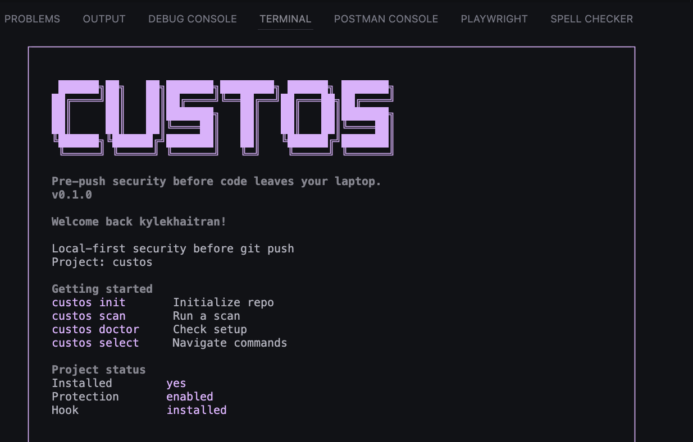
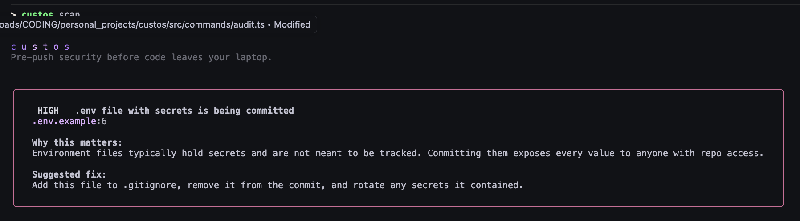
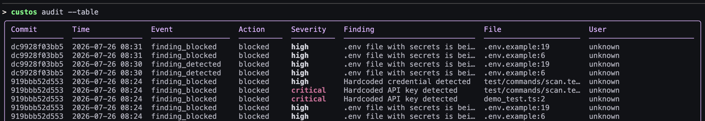
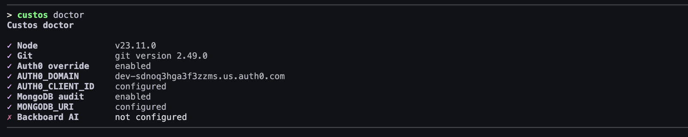
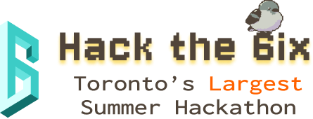
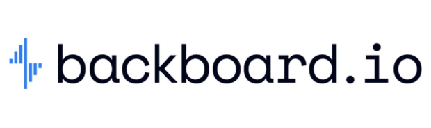
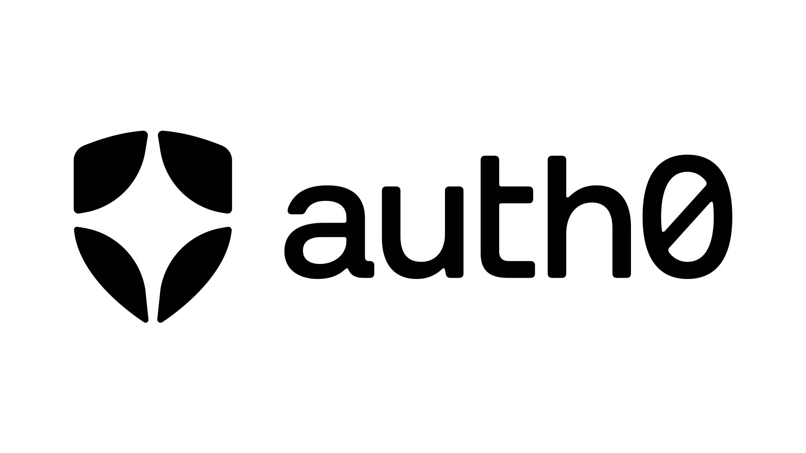
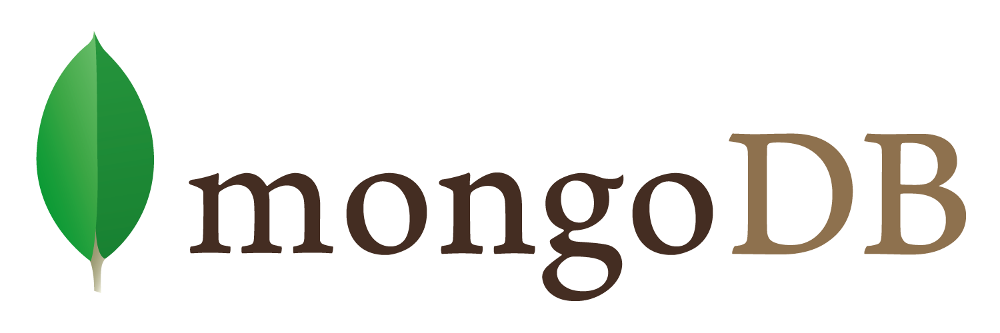

# Custos

Custos is a terminal-native CLI tool that brings extreme shift-left security to solo developers and small teams.

In the age of agentic coding, risky changes can slip in fast. Custos runs in your command line, installs a local Git `pre-push` hook, scans outgoing diffs before code leaves your laptop, and turns security decisions into clear terminal actions: patch it, inspect it, override with accountability, or block the push.

<br />
<div align="center">

[](https://devpost.com/software/custos-9xl5k4)

</div>

## What It Does

- Scans outgoing Git diffs locally before push.
- Detects security issues in changed lines with deterministic rules.
- Explains why each finding matters and what to do next.
- Offers an interactive action flow for patching, details, overrides, and exit.
- Supports multi-issue navigation so the developer can choose which finding to analyze.
- Writes structured audit events to MongoDB Atlas.
- Optionally gates push overrides through Auth0 Device Authorization Flow.

## Screenshots

### Welcome

The main `custos` screen shows project status, hook installation, and the core commands.



### Scan Finding

`custos scan` renders findings directly in the terminal with severity, file location, explanation, and suggested fix.



### Audit Table

`custos audit --table` shows recent MongoDB audit events in a compact terminal table.



### Doctor Check

`custos doctor` verifies the local setup for Git, Auth0, MongoDB, and Backboard configuration.



## Core Flow

```text
git push
  -> pre-push hook
  -> custos scan --pre-push
  -> outgoing diff
  -> local scanner rules
  -> terminal finding UI
  -> patch, details, Auth0 override, or abort
  -> MongoDB audit log
```

If Custos applies a patch, it still exits with a blocking status. The developer reviews the change, stages it, commits it, and pushes again.

## Commands

```bash
custos              # welcome screen and project status
custos init         # install the local pre-push hook
custos scan         # manually scan outgoing changes
custos scan --json  # machine-readable scan output
custos audit        # read recent MongoDB audit events
custos audit --table
custos doctor       # check local integration setup
custos select       # interactive command launcher
```

## Installation

For local development:

```bash
npm install
npm run build
npm link
cp .env.example .env
```

Then initialize Custos inside a Git repository:

```bash
custos init
```

## Configuration

Custos uses `.custos/config.json` for repo-level behavior and environment variables for secrets/integration credentials.

Important environment variables:

```env
MONGODB_URI=
MONGODB_DB=custos
CUSTOS_AUDIT_ENABLED=true

AUTH0_DOMAIN=
AUTH0_CLIENT_ID=
CUSTOS_ALLOW_OVERRIDE=false

BACKBOARD_API_KEY=
BACKBOARD_BASE_URL=https://app.backboard.io/api
```

Do not commit real `.env` files or secrets.

## Auth0 Overrides

Auth0 is optional. When enabled, it is only used during the pre-push flow, not plain `custos scan`.

If a developer selects `Force override with Auth0`, Custos:

1. Prompts for an override reason.
2. Starts Auth0 Device Authorization Flow.
3. Waits for identity verification.
4. Writes the override decision and token claims into the MongoDB audit log.
5. Allows the push only after the override succeeds.

The CLI Device Authorization Flow uses `AUTH0_DOMAIN` and `AUTH0_CLIENT_ID`. It does not use `AUTH0_CLIENT_SECRET`.

## MongoDB Audit Log

When audit logging is enabled, Custos stores events such as:

- `scan_passed`
- `finding_detected`
- `finding_blocked`
- `patch_applied`
- `override_approved`
- `override_denied`

Audit records include repo metadata, branch, commit SHA, user identity when available, finding details, override reason, JWT claims, action, and timestamp.

## Development

```bash
npm run dev -- --help
npm run build
npm start
npm run lint
npm run typecheck
npm test
```

Run commands locally through TypeScript:

```bash
npm run dev
npm run dev -- init
npm run dev -- scan
npm run dev -- audit
npm run dev -- doctor
```

## Future Updates

- Integrate Backboard.io AI functionality for smarter scan explanations and patch generation.
- Add additional authentication methods for overrides, including cross-platform devices, 2FA, and alternate identity providers.
- Expand scanner rules for dependency risk, package typosquatting, prompt-injection sinks, unsafe CORS, and dangerous shell execution.
- Add richer Auth0 override claims so signed tokens can include finding, file, commit, and override context.
- Strengthen MongoDB audit filtering by repo, branch, user, severity, action, and time range.
- Add optional MCP support so terminal agents can inspect Custos findings and audit history.
- Improve package distribution so teams can install Custos without local linking.

## Acknowledgements

<div align="center">

### This project was built for **Hack The 6ix 2026**



<br />
<br />


**Hack The 6ix 2026**

---

### Sponsored Integrations

<table>
  <tr>
    <td align="center" width="33%">
      
      <br />
      <strong>Backboard.io</strong>
    </td>
    <td align="center" width="33%">
      
      <br />
      <strong>Auth0</strong>
    </td>
    <td align="center" width="33%">
      
      <br />
      <strong>MongoDB Atlas</strong>
    </td>
  </tr>
</table>

</div>
